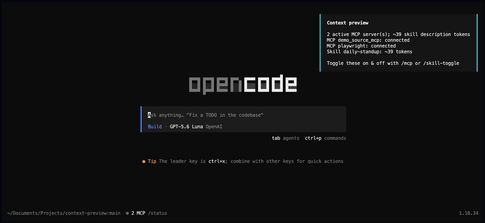

# OpenCode Context Preview

An OpenCode plugin to remind you to turn off skills and MCP servers



This plugin lists connected MCP servers and estimates how many tokens agent skill descriptions will add to the model context. It shows an itemized TUI toast during startup, caches a report for a local CLI command, and can toggle skills for the current OpenCode runtime.

## How it Works

When OpenCode starts, the plugin builds a report and displays an itemized TUI toast. It lists configured MCP servers that are enabled and currently `connected`. It discovers skills from the project and parent `.opencode` and `.agents` directories, global OpenCode/Agents directories, and any paths in `skills.paths`. Only valid `SKILL.md` files are included, and OpenCode skill permissions are applied first.

### Context Cost Estimates

The plugin estimates the context added by each skill's metadata, not the full contents of its `SKILL.md` file. For every discovered skill, it serializes this object:

```json
{"name":"skill-name","description":"Skill description"}
```

It counts Unicode characters in that serialized string, divides the count by four, and rounds up. The total shown in the preview is the sum of those per-skill estimates. When OpenCode sends its actual `<available_skills>` inventory, the plugin parses that inventory and reconciles the cached report with the names and descriptions that will be submitted to the provider.

### Disabling Skills

`/skill-toggle off <name>` (or `/skill-toggle <name>` to toggle) records the disabled name in memory for the current project. The setting is shared by plugin instances for that project and lasts until OpenCode restarts. Toggling starts a new session to clear the old conversation context.

For a disabled skill, the plugin:

- Removes its `<skill>` entry from OpenCode's `<available_skills>` system-prompt section.
- Removes the skill name and description wherever they appear in transformed system text and in the skill tool description.
- Rejects direct attempts to execute the skill tool for that skill.

The command is handled locally and does not make an LLM request. Configured skill permissions still take precedence, so a skill denied by OpenCode cannot be enabled with this command.

The report is cached locally so `opencode-context-preview` can display it without making an LLM request. If the first prompt arrives before the startup toast is visible, the plugin shows the preview and blocks that request before it reaches the model; text is restored when possible, while attachments must be reattached.

## Install

The plugin is installed automatically by OpenCode. Add its npm package name to
`~/.config/opencode/opencode.json`:

```json
{
  "$schema": "https://opencode.ai/config.json",
  "plugin": ["opencode-context-preview"]
}
```

Restart OpenCode after changing the plugin configuration.

Do not install the plugin globally with npm. OpenCode downloads npm plugins
with Bun and caches them under `~/.cache/opencode/node_modules/`.
When upgrading, use the exact published version so OpenCode does not reuse a
stale `latest` cache entry:

```sh
opencode plugin opencode-context-preview@0.1.1 --global --force
```

Replace `0.1.1` with the version being installed.

The plugin retries briefly while the TUI attaches. If the first prompt arrives before the startup preview appears, the plugin displays the preview and stops that request before it reaches the model. Prompt text is restored when possible; attachments must be reattached before resending. If the preview cannot be displayed, the request is also blocked by default.

For headless or automated use, disable this first-prompt gate with a plugin option:

```json
{
  "$schema": "https://opencode.ai/config.json",
  "plugin": [
    ["/absolute/path/to/context-preview/index.js", { "blockFirstPrompt": false }]
  ]
}
```

## View the full report

The report command is optional and is separate from installing the OpenCode
plugin. Install the package globally to make its executable available:

```sh
npm install --global opencode-context-preview
opencode-context-preview
```

Alternatively, run it without a global install:

```sh
npx --yes opencode-context-preview
```

The command searches the current directory and its parents for the latest cached report without making an LLM request. Add `--json` for machine-readable output or `--help` for usage. Restart OpenCode after changing configured MCP servers or installed skills. The plugin also reconciles the cache with the actual skill inventory before a provider request.

Reports are cached under `~/.cache/opencode/context-preview/`. Set `OPENCODE_CONTEXT_PREVIEW_CACHE_DIR` to use a different directory.

## Toggle skills

Use the plugin's `/skill-toggle` command to inspect or change skill availability for the current OpenCode runtime:

```text
/skill-toggle
/skill-toggle review
/skill-toggle off review
/skill-toggle on review
/skill-toggle toggle review
```

With no arguments, the command lists known skills and their `on` or `off` state. Passing only a skill name toggles it. Skill names must match exactly.

Changing a skill starts a new session to clear stale conversation context. A disabled skill is removed from the provider's skill inventory and skill-tool description, matching references in system instructions are redacted, and direct attempts to load it are blocked.

The command is handled locally without an LLM request. Toggle state is shared by plugin instances for the same project and lasts until OpenCode restarts. Configured skill permissions still take precedence.

## What is counted

- **MCP servers:** configured, enabled servers whose current status is `connected`. Their tool schemas and instructions are not counted.
- **Skills:** valid discovered skill names and descriptions, excluding skills denied by the default agent's permission rules. Before provider submission, this list is reconciled with OpenCode's actual `<available_skills>` system-prompt inventory.

Each skill estimate covers the serialized name and description and uses Unicode character count divided by four, rounded up. The displayed skill total is the sum of those estimates. MCP entries are status listings only; other system-prompt content is not counted.

## Development

```sh
npm test
```

### Publish a new version

After updating the plugin, run the tests, bump the package version, and publish
the package to npm:

```sh
npm test
npm version patch
npm publish
```

Use `minor` or `major` instead of `patch` when appropriate. `npm version`
creates a Git commit and tag. Push them to the repository separately:

```sh
git push --follow-tags
```

The package has no runtime dependencies. Its plugin entry point is `index.js`; the executable is `bin/context-preview.js`.
